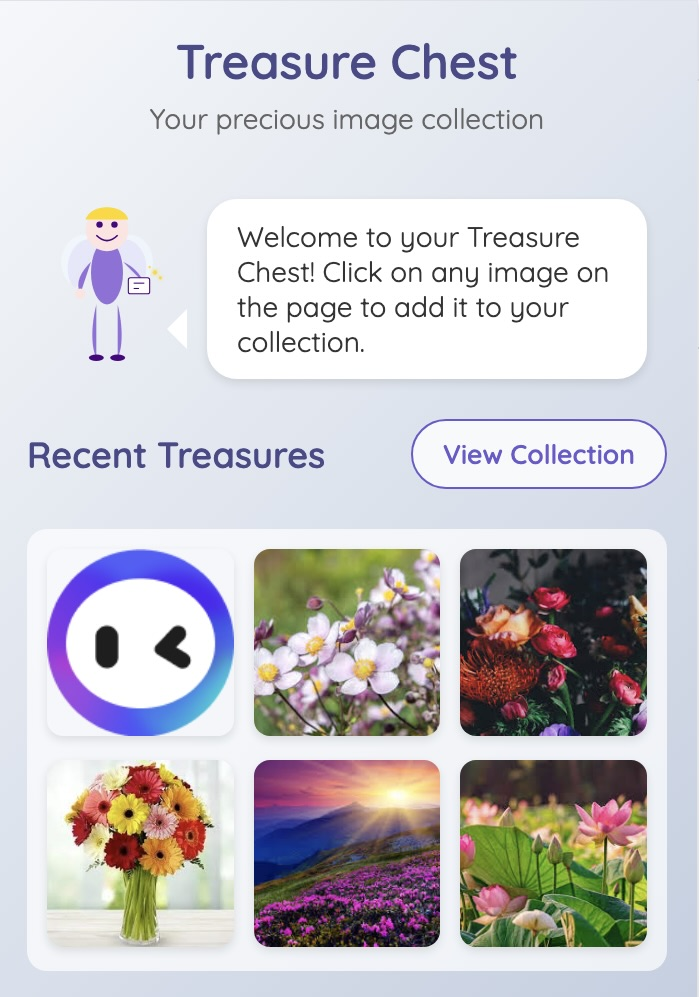
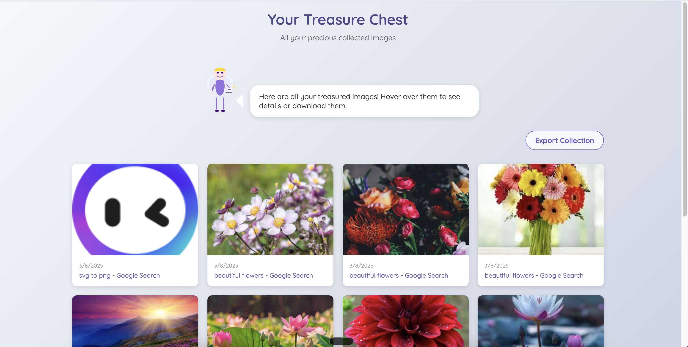

# Treasure Chest - Image Collector Chrome Extension

[English Version](#overview) | [中文版本](#概述)

### Overview

Treasure Chest is a Chrome extension that helps you collect and organize beautiful images while browsing the web. With an intuitive interface and easy-to-use features, you can build your personal collection of inspiring images.

### Features

- **Easy Image Collection**: Click on any image or use right-click menu to add to your collection
- **Visual Notifications**: Get beautiful notifications when images are added
- **Organized Collection**: View all your collected images in a grid layout
- **Image Management**:
  - Preview images in full size
  - Download individual images
  - Visit source pages
  - Delete unwanted images
- **Bulk Export**: Export your entire collection as a ZIP file with metadata

### Screenshots

### Installation

1. Clone this repository or download the source code
2. Open Chrome and navigate to `chrome://extensions/`
3. Enable "Developer mode"
4. Click "Load unpacked" and select the project folder
5. The extension icon will appear in your browser toolbar

### Usage

- **Collecting Images**:
  - Click on any image while browsing to add it to your collection
  - Or use the right-click menu and select "Add to Treasure Chest"
- **Viewing Collection**:
  - Click the extension icon to see recently collected images
  - Use "View Collection" to see your full collection
- **Managing Images**:
  - Hover over any image to see available actions
  - Preview images in full size
  - Download images to your computer
  - Visit the original source page
  - Remove images from your collection
- **Exporting Collection**:
  - Use the "Export Collection" button to download all images as a ZIP file
  - Includes metadata about each image's source and date collected

### Privacy

This extension works entirely on your device and doesn't collect or transmit any data. Your image collection is stored locally in your browser.

### Contributing

Contributions are welcome! Here's how you can help:

1. Fork the repository
2. Create a feature branch: `git checkout -b new-feature`
3. Commit your changes: `git commit -am 'Add some feature'`
4. Push to the branch: `git push origin new-feature`
5. Submit a pull request

### Development

To set up the development environment:

1. Clone this repository
2. Install dependencies (if any)
3. Load the extension in Chrome as an unpacked extension
4. Make your changes
5. Reload the extension to see your changes

### Future Enhancements

- Image categorization and tagging
- Search functionality
- Custom collections/folders
- Image editing capabilities
- Cloud sync support
- Browser sync support

### License

This project is licensed under the MIT License - see the LICENSE file for details.

---

### 概述

Treasure Chest 是一个Chrome扩展程序，帮助您在浏览网页时收集和整理精美图片。通过直观的界面和易用的功能，您可以建立自己的图片收藏集。

### 截图

### 功能

- **便捷的图片收集**：点击任何图片或使用右键菜单添加到收藏
- **视觉通知**：添加图片时显示精美的通知
- **有序的收藏集**：在网格布局中查看所有收藏的图片
- **图片管理**：
  - 全尺寸预览图片
  - 下载单张图片
  - 访问来源页面
  - 删除不需要的图片
- **批量导出**：将整个收藏集导出为ZIP文件，包含元数据

### 安装

1. 克隆此仓库或下载源代码
2. 打开Chrome并导航至`chrome://extensions/`
3. 启用"开发者模式"
4. 点击"加载已解压的扩展程序"并选择项目文件夹
5. 扩展图标将出现在浏览器工具栏中

### 使用方法

- **收集图片**：
  - 浏览时点击任何图片将其添加到收藏集
  - 或使用右键菜单选择"添加到Treasure Chest"
- **查看收藏**：
  - 点击扩展图标查看最近收藏的图片
  - 使用"查看收藏集"查看完整收藏
- **管理图片**：
  - 将鼠标悬停在任何图片上查看可用操作
  - 全尺寸预览图片
  - 将图片下载到计算机
  - 访问原始来源页面
  - 从收藏集中删除图片
- **导出收藏**：
  - 使用"导出收藏集"按钮将所有图片下载为ZIP文件
  - 包含每张图片的来源和收藏日期等元数据

### 隐私

此扩展完全在您的设备上运行，不收集或传输任何数据。您的图片收藏存储在浏览器本地。

### 许可证

本项目采用MIT许可证 - 详情请参阅LICENSE文件。
